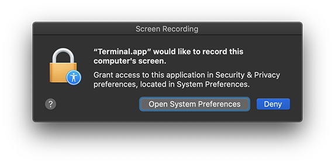

# README

Screenshooter takes screenshots of your macOS desktop at a preset interval.

## author

Saul Baizman  
[saul.baizman@massart.edu](mailto:saul.baizman@massart.edu)  
617 650 2783

## supported operating systems

Screenshooter runs **on macOS only** and should run on any recent-ish version of the operating system.

## installation

+ Download `screenshooter.sh` from [https://github.com/saulbaizman-teaching/screenshooter/archive/refs/heads/main.zip](https://github.com/saulbaizman-teaching/screenshooter/archive/refs/heads/main.zip).
+ Create a subfolder in your home folder named `bin` and move `screenshooter.sh` into `bin`.
+ Open Applications > Utilities > Terminal.
+ At the command prompt, enter the following text (**without the percent sign**) and press Return:

```
% chmod +x ~/bin/screenshooter.sh
```

If it worked, the command prompt will reappear and you won't see any other output.

## running screenshooter

+ Open Applications > Utilities > Terminal.
+ At the command prompt, enter the following text (**without the percent sign**) and press Return:

```
% ~/bin/screenshooter.sh
```

By default, screenshooter saves screenshots on your desktop every 15 minutes.

You may also specify the screenshot interval and location to save screenshots:

```
% ~/bin/screenshooter.sh 30 ~/Documents
```

The above command will take screenshots every 30 minutes and save them to the Documents folder.

### first-run permission prompt

The first time you run screenshooter, macOS may prompt you to allow Terminal to record the computer's screen.



Open System Preferences, navigate to the Security & Privacy pane, click the Privacy tab, scroll down to Screen Recording, and tick the checkbox for Terminal. When prompted, quit Terminal and open it again.

## stopping screenshooter

Press Control + C in the Terminal window or quit Terminal.

## bonus: make a shortcut (optional)

To make it easier to run screenshooter, make a shortcut.

At the command prompt, enter the following text (**without the percent signs**) and press Return:

```
% echo "alias ss=~/bin/screenshooter.sh" >> ~/.zshrc
% source ~/.zshrc
```

To invoke screenshooter henceforth at the command prompt, enter the following text (**without the percent sign**) and press Return:

```
% ss
```
